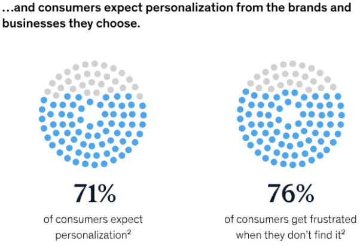
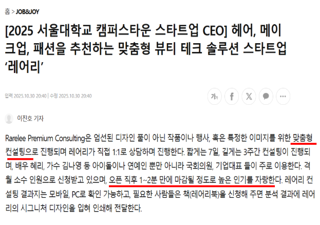
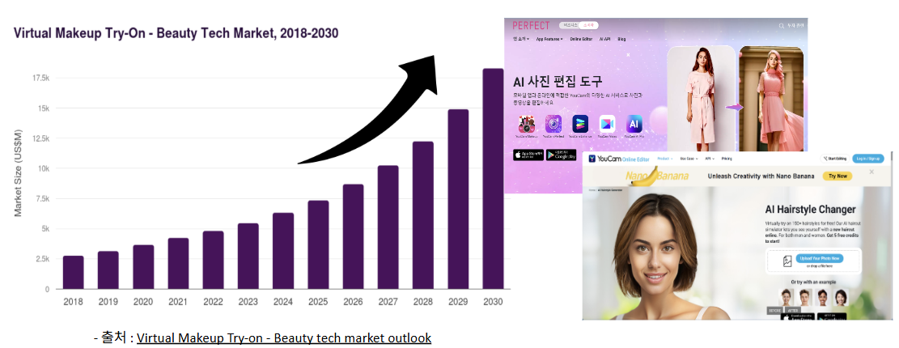
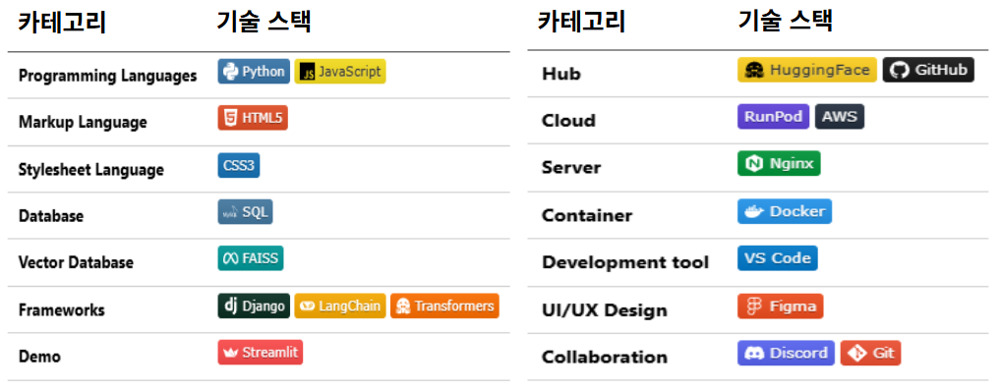
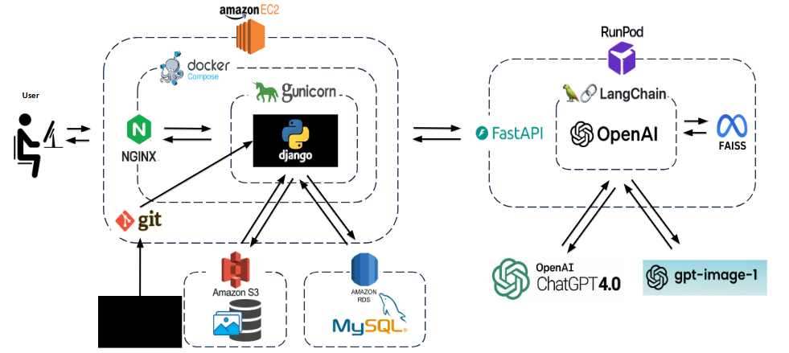
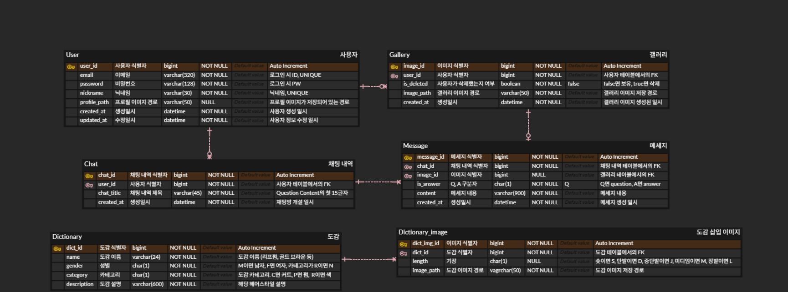

# SKN17-FINAL-1TEAM

활용한 LLM 모델 파일 제출, Retrieval-Augmented Generation (RAG) 아키텍처의 동작 방식을 설명하는 흐름도와 개발 코드

1. [팀소개](#1-팀소개)
2. [Introduction](#2-introduction)
3. [프로젝트 배경 및 필요성](#3-프로젝트-배경-및-필요성)
4. [기술스택](#4-기술스택)
5. [시스템 아키텍처](#5-시스템-아키텍처)
6. [ERD](#6-erd)
7. [방법론](#7-방법론)

 

## 1. 팀소개

### 💡팀명 : **HairAllYou**

### 🌟 팀원 소개

 

| 🥇 김세한 | 🥇 김주서 | 🥇 박지수 | 🥇 신승철  | 🥇 최동현 |
|:---:|:---:|:---:|:---:|:---:|
| img | width=150 | height=190 | alt="Image" | 예시 | 
| [@kimsehan11](https://github.com/kimsehan11) | [@kimjuseo-del](https://github.com/kimjuseo-del) | [@0lipa](https://github.com/0lipa) | [@ssshinnpson](https://github.com/ssshinnpson)  | [@Donghyun Choi](https://github.com/donghyun4957) |

 

## 2. Introduction

 

### **프로젝트 명 : Hairstyle is all you need**

### **프로젝트 목표**
**대화형 AI 상담 시스템 구축**: 사용자의 요구사항을 자연어로 이해하고, 텍스트를 통해 구체적인 스타일을 제안합니다.
**생성형 AI 기반 가상 피팅**: 상담 내용을 바탕으로 사용자의 얼굴에 어울리는 헤어스타일을 적용하고 이미지를 생성하여 제공합니다.
**최신 정보 제공**: 웹 서치 툴을 연동해 최근 유행하는 헤어스타일이나 트렌드 정보를 검색해 이에 대해 상담합니다.

 

## 3. 프로젝트 배경 및 필요성

  
  

 

최근 뷰티 산업은 꾸준한 성장 속에서 빠르게 변화하고 있습니다. 특히 소비자들은 더 이상 일률적인 정보나 추천에 만족하지 않고, 자신에게 꼭 맞는 스타일과 솔루션을 원하고 있습니다. 
2025년 맥킨지의 조사에서 소비자의 71%가 개개인을 고려한 뷰티서비스를 기대하고 있으며, 이 기대가 충족되지 않을 경우 76%가 부정적으로 해당 서비스를 인식한다는 것이 밝혀졌습니다. 이러한 소비자의 수요에 발 맞춰 여러 뷰티 업계들은 개인 맞춤형 서비스를 제공하고자 시도하고 있습니다.
이에 퍼스널 컬러와 퍼스널 헤어 컨설팅과 같은 서비스들이 호황기를 누리고 있습니다.

 

  

 

그러나 이 서비스를 이용하기 위해 고가의 비용을 지불해야하고, 서비스 이용 시간이 1시간 이상 소요되는 경우가 많아 번거로운 점이 있습니다. 이러한 오프라인 서비스의 대안으로,  VTO(Virtual Try-On) 기술이 주목받고 있습니다. 
VTO는 온라인 상에서 얼굴이나 신체에 원하는 스타일을 적용해볼 수 있도록 도와주는 가상 기술입니다. 의류, 메이크업을 시작으로 한 VTO 시장은 성장하며 점차 확대되고 있고, 현재 다양한 헤어스타일 체험 서비스 또한 출시되어 있습니다.

 

그러나 현재 제공되고 있는 온라인 맞춤형 서비스는 여전히 여러 불편함이 존재합니다. 87명을 대상으로 한 설문조사에서 AI 헤어스타일 서비스 만족도가 특히 낮다는 것을 확인할 수 있었습니다.
이에 대한 주요 불만 요인은 낮은 AI 이미지 퀄리티와 원하는 헤어스타일 이미지를 직접 찾아야 하는 과정의 번거로움 등이 지적되었습니다.
이러한 결과를 통해 사용자가 직접 이미지를 찾는 번거로움은 줄여주고 복잡한 메뉴 탐색 없이 쉽게 접근 가능하며 고퀄리티의 가상 체험을 제공하는 대화형 서비스의 공백을 확인했습니다.

 

하지만 사용자의 질의는 매우 다양하고 비정형적인 표현을 포함하고 있습니다. 
예를 들어, “가벼우면서도 러블리하고 너무 짧지는 않고, 가을 느낌이 물씬 나는 헤어스타일이 뭐가 있을까?” 와 같은 문장에서 핵심 취향을 정확히 추출하고 이를 얼굴 이미지까지 함께 고려해 적합한 스타일을 판단할 수 있어야 합니다.
이를 위해, 저희는 이미지-언어 멀티모달 AI 모델을 활용한 헤어스타일 맞춤 상담 챗봇 개발을 목표로 프로젝트를 진행했습니다.

 

## 4. 기술스택

  

 

## 5. 시스템 아키텍처

  

 

## 6. ERD

  

 

## 7. 방법론

본 프로젝트는 헤어스타일 추천의 정확도를 높이기 위해 OpenAI text-embedding-3-small 모델을 벡터 임베딩으로 활용한 RAG 시스템을 구축하였습니다. 벡터 데이터베이스: FAISS 기반 인덱스 구축했습니다. + 리랭킹

검색 메커니즘: 유사도 기반 검색 + 메타데이터 필터링 (성별, 얼굴형, 퍼스널 컬러, 계절)

QA 캐시 시스템:
이전 추천 결과를 벡터스토어에 저장하여 유사 질의 시 빠른 응답 제공

데이터 구성:
헤어스타일, 헤어컬러, 얼굴형별 최적 스타일 정보

퍼스널 컬러(봄/여름/가을/겨울)별 추천 가이드
성별 및 기장별 세분화된 헤어스타일 데이터

### 7.2 언어 모델 및 이미지 생성 모델
#### 7.2.1 대화형 에이전트 - ChatGPT
모델: gpt-5.2-chat-latest (프로덕션)
프레임워크: LangChain 기반 멀티모달 에이전트

역할:
사용자 의도 파악 및 대화 관리
4가지 도구(추천/생성/검색) 호출 결정
추천 결과 자연어 생성

#### 7.2.2 이미지 생성 - gpt-image-1
모델: OpenAI gpt-image-1
용도: 헤어스타일 시뮬레이션 이미지 생성
입력: 사용자 얼굴 이미지 + 헤어스타일/컬러 조건
출력: 1024x1024 고해상도 이미지

### 7.3 헤어스타일 추천 알고리즘
#### 7.3.1 오픈소스 모델 활용

모델 2: SAFMN (Spatially-Adaptive Feature Modulation Network) (model/SAFMN/)
기능: 초해상도 (Super-Resolution)
성능: 2배 업스케일 (512x512 → 1024x1024)
아키텍처:
128차원, 16블록, FFN scale 2.0
NTIRE 2023/2024 ESR Challenge 우수 성능
활용: 얼굴 이미지 전처리 단계에서 해상도 향상

#### 7.3.2 퍼스널 컬러 분류 알고리즘 (논문 기반)

알고리즘 절차:

Stone 라이브러리를 활용한 얼굴 영역 피부 색상 추출
RGB 튜플로 대표 색상 선정
색공간 변환
퍼스널 컬러 분류

기준값: V₀ = 72.5 (밝기), B₀ = 15.5 (색상)
분류 규칙:
b* ≥ B₀ and L ≥ V₀ → 봄 웜톤 (밝고 따뜻함)
b* ≥ B₀ and L < V₀ → 가을 웜톤 (어둡고 따뜻함)
b* < B₀ and L ≥ V₀ → 여름 쿨톤 (밝고 차가움)
b* < B₀ and L < V₀ → 겨울 쿨톤 (어둡고 차가움)

정확도: 피부색 기반 4계절 분류로 개인화된 헤어컬러 추천 가능

#### 7.3.3 추천 파이프라인
Step 1: 이미지 분석 (model/tools.py 구현)
입력 이미지
    ↓
[IdentiFace] → 얼굴형 분류 (Round/Oval/Heart/Oblong/Square)
             → 성별 분류 (Male/Female)
    ↓
[Stone 라이브러리] → 피부색 추출
    ↓
[퍼스널 컬러 알고리즘] → 계절 분류 (봄/여름/가을/겨울)
Step 2: 가중치 기반 추천 점수 계산
Step 3: Top-3 추천 생성
점수 상위 3개 헤어스타일 선정
RAG에서 상세 설명 검색 및 반환

### 7.4 이미지 생성 알고리즘
전체 파이프라인: 
사용자 이미지 
    ↓
[1] FaceCropper → 얼굴 영역 감지 및 크롭
    ↓
[2] SAFMN → 초해상도 처리 (2x)
    ↓
[3] Reference JSON 조회 → 헤어스타일/컬러 레퍼런스 이미지 경로
    ↓
[4] gpt-image-1 → 프롬프트 기반 이미지 생성
    입력: 사용자 얼굴 + 헤어스타일 조건 + 컬러 조건
    ↓
[5] FaceSwap → 원본 얼굴과 생성 이미지 합성
    ↓
[6] (선택) FaceLift → 3D 얼굴 재구성
    - Gaussian Splatting 기반
    - Multi-view Diffusion 활용
    ↓
최종 결과 이미지 반환

### 7.5 에이전트 구축
아키텍처: LangChain 기반 멀티모달 에이전트

#### 7.5.1 에이전트 구성 요소
핵심 클래스: HairstyleAgent
class HairstyleAgent:
    - model: IdentiFace (얼굴형/성별 분석)
    - client: OpenAI API 클라이언트
    - vectorstore: FAISS 벡터스토어
    - safmn_model: SAFMN 초해상도 모델
    - face_cropper: 얼굴 크롭 모델
    - models_3d: FaceLift 3D 재구성 모델

#### 7.5.2 도구 (Tools) 정의
Tool 1: hairstyle_recommendation_tool (이미지 기반 추천)
입력: 이미지 + 선택적 조건 (성별, 기장, 스타일, 컬러, 계절)
처리:
IdentiFace로 얼굴형/성별 분석
퍼스널 컬러 알고리즘 실행
RAG 벡터스토어 검색
가중치 기반 Top-3 추천

Tool 2: non_image_recommendation_tool (텍스트 기반 추천)
입력: 성별, 얼굴형 + 선택적 조건 (퍼스널 컬러, 계절, 스타일, 컬러, 길이)
처리: RAG 검색 및 필터링
출력: 조건 일치 헤어스타일 추천

Tool 3: hairstyle_generation_tool (이미지 생성)
입력: 이미지 + 헤어스타일/컬러/기장

처리: 7.4절 이미지 생성 파이프라인 실행
출력: 생성된 이미지 경로 + 3D 모델 (선택)

Tool 4: web_search_tool (웹 검색)
DuckDuckGo API 활용
헤어스타일 트렌드, 미용실 정보 등 실시간 검색

#### 7.5.3 에이전트 실행 흐름
사용자 입력
    ↓
[캐시 확인] QA 벡터스토어에서 유사 질의 검색
    ├─ 캐시 히트 → 즉시 반환
    └─ 캐시 미스 ↓
[ChatGPT 에이전트]
    - 입력 분석 (의도, 이미지 유무, 파라미터)
    - 적절한 도구 선택 및 호출
    - 결과 종합 및 자연어 응답 생성
    ↓
[캐시 저장] 결과를 QA 벡터스토어에 저장
    ↓
사용자에게 응답 반환
메시지 히스토리 관리:
RunnableWithMessageHistory 활용
세션별 대화 컨텍스트 유지
이전 추천 기반 연속 대화 지원

## 8.

